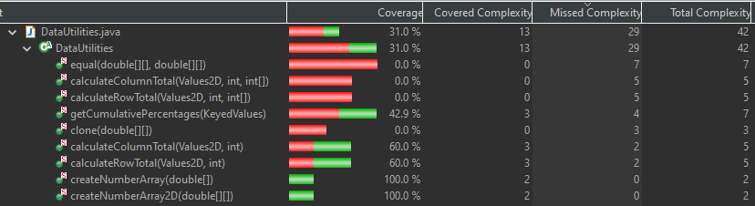

**SENG 637 - Dependability and Reliability of Software Systems**

**Lab. Report #3 – Code Coverage, Adequacy Criteria and Test Case Correlation**

| Group \#:6     |     |
| -------------- | --- |
| Student Names: |     |
| Sean Temple    |     |
| John Chernoff               |     |
| Nicholas Langley               |     |
| Raisa Mehjabin Azni            |   
| Eric Yoon            |   


# 1 Introduction

This assignment is similar to assignment 2 with changed expectations and access to the source code allowing white box testing. After copying the tests from assignment 2 to the new codebase we tested for code coverage metrics before and after attempting to increase our code coverage. For one method from DataUtilities and one from Range, we manually analyzed each generating data flow graphs and def-use information to determine what tests would be required for full coverage. Using mainly EclEmma we gathered reports on testing coverage for all tested methods in each class.

# 2 Manual data-flow coverage calculations for X and Y methods

We are using EclEmma for reports.
Complexity here refers to cyclomatic complexity paths covered.

## Range

Instruction coverage before changes


Instruction Coverage is more detailed than a statement as the contains method shows 100% statement but 92.9% instruction coverage; this is why we used Instruction coverage instead of line/statement coverage for the Range class. It will hopefully allow for improvement in the next sections of the assignment.

Branch coverage before changes


Cyclomatic complexity coverage before changes


Constructor:
    
    22/22 instructions - 100% instructions coverage
    2/2 branches - 100% branch coverage
    2/2 complexity - 100% complexity coverage

getLowerBound:

    9/20 instructions- 45% instructions coverage
    1/2  branches - 50% branch coverage
    1/2 complexity - 50% complexity coverage
	
getUpperBound:

    9/20 instructions- 45% instructions coverage
    1/2  branches - 50% branch coverage
    1/2 complexity - 50% complexity coverage

getLength:

    12/23 instructions- 52.2% instructions coverage
    1/2  branches - 50% branch coverage
    1/2 complexity - 50% complexity coverage

getCentralValue:

    10/10 instructions- 100% instructions coverage
    No branches to cover - 100% branch coverage
    1/1 complexity - 100% complexity coverage

Contains:
    
    26/28 instructions- 92.9% instructions coverage
    6/8 branches, - 75% branch coverage
    3/5 complexity - 60% complexity coverage

Constrain:

    25/25 instructions- 100% instructions coverage
    5/6 branches - 83.33% branch coverage 
    3/4 complexity - 75% complexity coverage
	
Equals:

    24/26 instructions- 92.3% instructions coverage
    5/6  branches - 83.33% branch coverage
    3/4 complexity - 75% complexity coverage

Range Totals for intentionally covered methods:
(all except contains method)

    108/146 Instructions = 74% Instruction Coverage
    21/28 branch paths = 75% branch coverage
    12/17 complexity = 70.59% complexity coverage


Junit in combination with EclEmma provided all the information we needed.

## DataUtilities
**calculateColumnTotal**
  - 9/12 Lines = 75% statement Coverage 
  - 5/8 Branches = 62.5% branch coverage 
  - 3/5 Complexity = 60% complexity coverage
    
**calculateRowTotal**
- 9/12 Lines = 75% Instruction Coverage
- 5/8 Branches = 62.5% branch coverage
- 3/5 Complexity = 60% complexity coverage

**getCumulativePercentages**
- 15/18 Lines = 83.3% Instruction Coverage
- 7/12 Branches fully covered = 58.3% branch coverage
- 3/7 Complexity= 42.9% complexity coverage

**createNumberArray**
- 5/5 Lines = 100% Instruction Coverage
- 2/2 fully covered = 100% branch coverage
- 2/2 = 100% complexity coverage

**createNumberArray2D**
- 6/6 Lines= 100% Instruction Coverage
- 2/2 Branches fully covered = 100% branch coverage
- 2/2 Complexity = 100% complexity coverage

**DataUtilities Totals for Intentionally Covered Methods**
- 44/53 Instructions = 83.02% Instruction Coverage
- 21/32 Branch paths = 65.63% branch coverage
- 13/21 Complexity = 61.90% complexity coverage
  
Original Data Utilities Statement (Line) Coverage


Original Data Utilities Branch Coverage


Original Data Utilities Complexity Coverage


DataUtilities.calculateColumnTotal:

```java
public static double calculateColumnTotal(Values2D data, int column,
            int[] validRows) {
    ParamChecks.nullNotPermitted(data, "data");
    double total = 0.0;
    if (total > 0){
        total = 100;
    }
    int rowCount = data.getRowCount();
    for (int v = 0; v < validRows.length; v++) {
        int row = validRows[v];
        if (row < rowCount) {
            Number n = data.getValue(row, column);
            if (n != null) {
                total += n.doubleValue();
            }
        }
    }
    return total;
}
```

## Data Flow Graph:


## Def-use sets per statement:

start/method called: calculateColumnTotal(Values2D data, int column)
def = {data, column}

1: ParamChecks.nullNotPermitted(data, "data");
c use = {data}

2: double total = 0.0;
def = {total}

3: int rowCount = data.getRowCount();
def = {rowCount}
   	c use = {data}

4: for (int r = 0; r < rowCount; r++) {
def = {r}
    	p use = {rowCount}

5: Number n = data.getValue(r, column);
def = {n}
 	   c use = {data, r, column}

6:  if (n != null) {
p use = {n}

7: total += n.doubleValue();
c use = {total, n}

8: end of for loop
 c use = {r}
    	 p use = {r, rowCount}

9: for (int r2 = 0; r2 > rowCount; r2++) {
def = {r2}
    	p use = {rowCount}

10: Number n = data.getValue(r2, column);
def = {n}
      	c use = {data, r2, column}

11: if (n != null) {
p use = {n}

12: total += n.doubleValue();
c use = {total, n}

13: end of for loop 
c use = {r2}
      p use = {r, rowCount}

end/return: return total;
c use = {total}

## List All DU-Pairs Per Variable

| Variable | Defined in node | DCU (v, n) | DPU (v, n) |
|----------|-------------|-----|-----|
| data    |start| {1, 3, 5, 10} |{}|
| column    |start| {5, 10} |{}|
| total   |2| {7, 12, end} |{}|
| rowCount    |3| {} |{(4,5),(4,9),(8,4),(8,9),(9,10),(9,end),(13,9),(13,end)}|
| r |4| {5. 8} |{(4,5), (4,9), (8,4),(8,9)}|
| n (1)    |5| {7} |{(6,7),(6,8)}|
| r2    |9| {10, 13} |{(13,9),(13,end)}|
| n (2)    |10| {12} |{}|


## Coverage per Test Case
calculateColumnTotal_WithPositiveValues - most test cases have this same coverage
 - Data
   - Covers all DCU pairs - {1, 3, 5, 10}
- column
   - Covers all DCU pairs - {5, 10}
- Total
   - Covers 2 / 3 DCU pairs (one is inaccessible with current code) - {7, end}
- RowCount
   - Covers all accessible Dpu pairs except for (4,9)(when data has no rows)- {(4,5), (8,4), (8,9), (9,end)}
- r
   - Coversall Dcu pairs - {5, 8}
   - Covers 3 / 4 DpuPairs - {(4,5),(8,4), (8,9)} - (missing pair requires a data input with no rows)
- n
   - Covers all Dcu pairs {5, 8}
   - Cover 1/2 Dpu pairs (where n != null) - {(6,7)}
- r2
   - Covers the only accessible Dcu pair ({10})
   - Covers the only accessible Dpu pair ({(13, end)})

calculateColumnTotal_WithNullValue
   	Same as the first test case in section EXCEPT
    	also covers the last Dpu pair for the n variable (when n is null) - {(6,8)}

calculateColumnTotal_WithNoRows
  	Covers the last accessible rowCount and r Dpu pairs - {(4,9)} for both

The other columns total test all have identical coverage to the first test case in this section
All accessible Dcu and Dpu pairs are covered, the rest are locked behind a condition that can't be met

Each test case covers:
- The definition and use of data through mock interactions.
- The initialization and conditional modification of the total.
- The definition and use of rowCount through data.getRowCount().
- The loop execution, affecting v, validRows, row, and the internal logic based on n.
Specific Coverages:
- With Positive Values: Covers the definition and use of all variables due to loop execution and conditions being met for positive value accumulation.
- With Null Input: Directly covers the null check on data.
- With Negative Values, Mixed Values, Zero Values, Large Dataset, and No Rows: Each of these tests covers various aspects of the loop and conditionals, specifically the handling of different value types and quantities.

## Range.contains:
```java
    1 public boolean contains(double value) {
    2       if (value < this.lower) {
    3           return false;
    4       }
    5       if (value  > this.upper) {
    6           return false;
    7       }
    8       return (value >= this.lower && value <= this.upper);
    9 }
```

## Data Flow Graph:


## Def-use sets per statement:

line: Statement

1: public boolean contains(double value) {

    Def: value
    Use: None

2: if (value < this.lower) {

    Def: None
    Use: value
3: return false;

    Def: None
    Use: value
5:if (value  > this.upper) {

    Def: None
    Use: value, this.upper
6: return false;

    Def: None
    Use: value
8: return (value >= this.lower && value <= this.upper);

    Def: None
    Use: value, this.lower

## List All DU-Pairs Per Variable

| Variable | Def in node | DCU | DPU |
|----------|-------------|-----|-----|
| value    |1| {1} |{(2,3),(2,4),(3,5),(3,6)}|

CU = 1, PU = 4

## Coverage per Test Case

TC1:value<lower

TC2:value>upper

TC3:lower<value<upper

The other case is infeasible as it is impossible to have Range with lower > upper. Making line 8 the same as: "return true;" 
it is good defensive programming to write line 8 the way it is though.
As such it's impossible to improve coverage.

# 3 A detailed description of the testing strategy for the new unit test

For the two classes we are testing, and each of the methods within, the general strategy is to run a coverage test and review it line by line. The coverage tests will be reviewed by all group members and the tests will be developed to improve coverage by all group members in coordination. Once the initial coverage test is run, each of the coverage areas which are instruction, branch and complexity will be reviewed for each method of each class. 

Where the coverage is initially incomplete or missed, the test code is manually inspected to see where the deficiency can be addressed. After implementing the change the coverage test is re-run to see if the deficiency is solved or not. This iterative process is conducted for each type of coverage until the minimum values of 90% for statements, 70% for branches, and 60% for conditions. 

# 4 A high level description of five selected test cases you have designed using coverage information, and how they have increased code coverage

For Range, we had one new test case designed as the testing from the last assignment covered almost all code that is possible to reach. The new test case is for the method equals and it passes a non-Range object for comparison which covers some additional code not caught by assignment 2 testing. The only parts left not covered are inaccessible code that although should never be run is good defensive programming. The details for each method will be covered in later sections.  

**For DataUtilities a few updates were made:**
1. getCumalitivePercentages had to be updated to include test cases for infinite, NaN, and null values. By adding in these test cases the instruction (statement) coverage was increased as some instructions were missed before.
2. createNumberArray and createNumberArray2D were updated with new test cases for infinity and NaN values to catch missing branches.
3. calculateColumnTotal and calculateRowTotal were updated with new test cases for infinity values to catch missing branches and instructions.

# 5 A detailed report of the coverage achieved of each class and method (a screenshot from the code cover results in green and red colour would suffice)

## Range
Changes include adding actual intentional tests for contains method with no added coverage. The equals method now has a test for non-range objects that brings its coverage up to 100%. We will explain in detail later why it's impossible to add tests to increase coverage for most of the other methods without changing the source code and after how one would change the source code to get 100% coverage.
	
Equals:

    before:
    24/26 instructions- 92.3% instructions coverage
    5/6  branches - 83.33% branch coverage
    3/4 complexity - 75% complexity coverage

    after:
    26/26 instructions- 100% instructions coverage
    6/6  branches - 100% branch coverage
    4/4 complexity - 100% complexity coverage

New Range Totals for intentionally covered methods:

    136/174 Instructions = 78.2% Instruction Coverage
    28/36 branch paths = 77.8% branch coverage
    16/22 complexity = 72.7% complexity coverage

### Instruction Coverage

As shown above, the equals method now has 100% coverage due to the additional test for when it is passed a non Range object.

Details of the tested methods with less than 100% coverage:

92.9% coverage of contains method:

```java
    public boolean contains (double value) {
        if (value < this.lower) {
            return false;
        }
        if (value  > this.upper) {
            return false;
        }
        return (value >= this.lower && value <= this.upper);
    }
```

The last 7.1% is from the final return statement only ever being evaluated to true as false can only occur if the lower bound is greater than the upper. Lower will never be higher than upper as there are no setter methods and the constructor prevents a Range object from being created with lower higher than upper.

52.2% coverage of getLength

45% of getUpperBound and getLowerBound

All three of these methods have the same inaccessible code issue for the same reason as the contains method:

```java
    if (lower > upper) {
        String msg = "Range(double, double): require lower (" + lower + ") <= upper (" + upper + ").";
            throw new IllegalArgumentException(msg);
    }
```

In summary, the only reason the tests don't have 100% coverage is because the constructor prevents lower > upper and there is no way to access the private members to create such conditions without editing values in memory or some other kind of memory corruption.

### Branch Coverage


Same as instruction coverage the get methods for upper, lower, and length have the same issue where the code inside if (lower > upper) will never be run.

The contains method has a similar issue to before where this method has branches that will never run due to how the method is written.
original:

```java
    public boolean contains(double value) {
        if (value < this.lower) {
            return false;
        }
        if (value  > this.upper) {
            return false;
        }
        return (value >= this.lower && value <= this.upper);
    }
```

Written so it works, has less code, fewer branches, and all code can be run:

```java
    public boolean contains(double value) {
        return (value >= this.lower && value <= this.upper);
    }
```

Constrain although every line is run has an else if statement that will never run as the if(!contains(value)) statement will prevent any value within the range from being evaluated at the else if (value < this.lower) making it always evaluate to true.

```java
    public double constrain(double value) {
        double result = value;
        if (!contains(value)) {
            if (value > this.upper) {
                result = this.upper;
            }
            else if (value < this.lower) {
                result = this.lower;
            }
        }
        return result;
    }
```

Cleaner code that will allow all branches and instructions to be covered:

```java
    public double constrain(double value) {
        double result = value;
        if (!contains(value)) {
            if (value > this.upper) {
                result = this.upper;
            }
            else {
                result = this.lower;
            }
        }
        return result;
    }
```

### Cyclomatic Complexity Coverage


For all the same reasons as before the get methods for upper, lower and length only have 50% coverage with no way to improve without just removing the bound checking in the source code.

equals method now has 100% coverage due to the test using non Range objects. 

Constrain and contains have less than 100% coverage for the same reasons as before. Without altering the source code as shown in the branch coverage section it is impossible to increase the coverage.

## DataUtilities
Added two tests for getCumulativePercentages:
One including infinity/NaN values
One including null values

Other covered methods only had statements/branches that could not actually be reached so coverage could not be increased.

getCumulativePercentages:
15/18 -> 15/18 Lines (No change) - 83.3% Instruction Coverage
7/12 -> 9/12 branches - 75% branch coverage (+16.67%)
3/7 -> 5/7 complexity - 71.43% complexity coverage (+28.57%)


DataUtilities Totals for intentionally covered methods:
44/53 Instructions = 83.02% Instruction Coverage (No change)
23/32 branch paths = 71.88% branch coverage (+6.25%)
15/21 complexity = 71.43% complexity coverage (+9.53%)

Data Utilities statement coverage


Data Utilities branch coverage


Data Utilities complexity coverage


# 6 Pros and Cons of coverage tools used and Metrics you report

This report employs EclEmma for reporting coverage metrics, benefiting from its support for statement and branch coverage, albeit lacking support for condition coverage. Despite exploring alternative tools, achieving condition coverage proved challenging. For example, although CodeCover offers condition coverage, it seems to have been discontinued from support, resulting in errors when attempting to use it with the current version of Eclipse. Upon researching the issue, it was found that only Eclipse Kepler is compatible with CodeCover. Attempts to install Eclipse Kepler for testing CodeCover encountered difficulties running JFreeChart code in that version. While JaCoCo presents a similar feature set to EclEmma, with no notable differences, the latter remains preferred. Clover, another tool that was successfully installed, unfortunately, did not recognize any of the JUnit test cases, consistently reporting zero coverage. This issue suggests that either some refactoring of the test suite setup is necessary or a more advanced configuration of the Eclipse workspace is required to operationalize Clover effectively, necessitating users to compile it themselves for IDE integration, a process hindered by inadequate instructions. As a result, EclEmma served as the sole tool for all test coverage assessments, replacing condition coverage with complexity coverage together with branch coverage and instruction coverage.

## EclEmma
EclEmma is a tool that seamlessly integrates with Eclipse and JUnit, providing immediate feedback on statement and branch coverage, which are easily highlighted. It features instruction coverage, which lists the amount of bytecode instructions covered. However, this metric can be somewhat misleading as the numbers do not directly correlate with lines of code. This discrepancy means that missing certain instructions could significantly impact the coverage percentage. This detail is particularly relevant for lines containing complex instructions, as ensuring these instructions are tested may disproportionately influence the coverage metric.

Line coverage, on the other hand, is straightforward, indicating the specific lines of code that tests cover. It offers a clear visual on which portions of the code are tested but falls short in detailing complex interactions, such as branch or condition coverage.

Branch coverage focuses on the decision points within the code, allowing developers to identify which conditions have not been fully explored. However, it lacks specificity in indicating which particular branch or condition was missed, necessitating manual investigation to address these gaps.

Complexity coverage delves into the paths taken through an entire method, shedding light on more intricate behaviours and the effectiveness of test coverage on method utilization. Like branch coverage, it does not specify which paths were or were not covered, requiring further manual analysis to enhance coverage. Unfortunately, there is no easily visible overlay over the code for this metric.

Method coverage is simpler, essentially indicating whether a method has been tested. This is particularly useful for larger codebases, helping identify untested methods. However, in the context of this lab, its utility is limited due to the ease of manually tracking method coverage.

### Features and Limitations

- **Works out of the box with Eclipse + JUnit**
- **Highlights statement/branch coverage easily**

- **Instruction coverage**: Lists the amount of bytecode instructions covered, somewhat misleading as the numbers are not 1-1 with lines of code, so depending on which instructions are missed, may have a larger impact on coverage percentage.
- **Line Coverage**: Individual lines of code covered, easy to understand and can tell at a glance what portions of code tests cover. Doesn’t fully explain the more complex interactions for metrics like branch or condition coverage.
- **Branch coverage**: Branch decisions covered, easily see which are not fully explored, to see which conditions tests need to be based around. Does not seem to tell you which specific branch condition(s) were missed just that some were missed. So manual investigation will need to be done to find this out.
- **Complexity coverage**: Paths through the entire method taken, covers more complex behaviors. Can give you an idea of how well the method is utilized by the tests. Does not tell you which possible paths are covered/missed so a manual investigation will have to be done to figure out how to raise this coverage. No easily visible overlay over the code.
- **Methods coverage**: Mostly just tells you if a method is covered or not. Useful on a larger codebase scale, to see if methods are missed by testing. On the scale of this lab, however, it is pretty useless as it's easy to keep track of this manually.

## CodeCover
The instructions on the code cover site for installing the Eclipse Plugin do not seem to work so this could not be tested.

## Clover
Able to install, but could not get it to recognize any of the JUnit test cases. Always returned zero coverage. Appears to need some refactoring of the test suite setup or a more advanced Eclipse workspace setup to get working.

# 7 A comparison on the advantages and disadvantages of requirements-based test generation and coverage-based test generation.

With regard to code coverage adequacy criteria and test case correlation, the comparison of requirements-based and coverage-based test creation provides a detailed understanding of their benefits and drawbacks in the context of software testing. 
**Requirements-Based Test Generation:**
- **Advantages:** 
- **Direct Alignment with User Expectations:**Verifies that the program satisfies all stated user requirements, focusing directly on the features that users anticipate.
- **Focused Testing Strategy:** This testing strategy is useful for confirming functional correctness since it focuses on specific requirements, enabling focused testing of key features.
** Disadvantages:** 
- **Potential Ignorance of Unspecified Behaviors:** Potentially neglects to test for behaviors not covered by the original requirements, which could result in the overlooking of edge situations or problems not stated in detail in the specifications.
- **Requirement Quality Determination:** The precision, thoroughness, and clarity of the user requirements will have a major impact on how well this testing works. Inadequate testing coverage of the functionality of the product might result from poorly defined requirements.

**Coverage-Based Test Generation:** 
- **Advantages:** 
- **Detailed Examination of the Code:** Aiming for high code coverage helps to find hidden vulnerabilities and flaws that aren't immediately related to defined user needs, which improves the overall dependability of the software.
- **Determination of Unused Routes:** provides a methodical way to locate and test codebase routes that have not been run, possibly exposing unexpected or unwanted behaviors.

**Disadvantages:**
- **Resource Intensive:** Reaching high coverage metrics can be time- and resource-consuming, making this a more expensive approach in terms of development work.
- **Risk of Quantity Over Quality:**The danger of choosing quantity over quality Coverage metrics can be prioritized over testing depth, but doing so could lead to tests that are too superficial and don't sufficiently evaluate the software's logic or essential features.

Finally, This testing challenge emphasizes how crucial it is to use both approaches simultaneously in order to handle the complex nature of software quality. While coverage-based testing offers an extensive examination of the software's codebase, it also finds flaws that the requirements might have missed. Requirements-based testing guarantees that all functionality significant to the user are tested and satisfy the defined criteria. By combining these techniques, software systems' structural integrity and functional correctness are improved, providing a well-balanced approach that eventually produces more trustworthy software.

# 8 A discussion on how the teamwork/effort was divided and managed

Our team divided work based on individual strengths. We assigned the manual data flow coverage calculations to members with strong analytical skills (John, Sean, Nicholas), while those interested in report organization and writing took on the simpler report sections (Eric, Raisa). We held weekly meetings to track progress, share insights, and collaboratively solve and provide feedback on the newly designed unit tests. Task division was dynamic; members could trade tasks based on personal workload or health. Whenever a group member was sick, the work would be picked up by another group member, which improved teamwork and organization of the team. Furthermore, we used a shared repository for code and documentation, ensuring that all team members could review and contribute to each other's work, fostering a collaborative learning environment.

# 9 Any difficulties encountered, challenges overcome, and lessons learned from performing the lab

In addition to the initial challenges, we faced difficulties in manually calculating data flow coverage due to the complexity of understanding the flow of data through the code. This exercise, while challenging, significantly improved our comprehension of how data moves within programs and how this affects testing strategies. We learned the importance of thorough code understanding before test case development, enhancing our ability to write more effective tests.

Regarding lessons learned, one thing that helped significantly was the practice of reflection and feedback—both on the technical aspects of testing and our teamwork. After developing new design tests, we took the time to reflect on what worked, what didn't, and how we could improve which gave us new insights into different ways of coding.

Another lesson was that coverage is a valuable tool for pinpointing what's lacking in test cases. However, it only evaluates if the tests address all aspects of the code, overlooking the requirements. The requirements are important as well regarding testing, so both work in unison to provide a comprehensive evaluation of the software's functionality and reliability.


# 10 Comments/feedback on the lab itself

The assignment was well-structured, providing a clear pathway from understanding the basics of testing to applying complex coverage criteria. It was a great opportunity to benchmark how well our unit testing using black-box test-case design techniques in the previous assignment performed, and also how much we could improve the tests.

However, a more detailed guide on selecting and using code coverage tools would be beneficial, as some team members found the initial setup challenging. Overall, the assignment was an eye-opening learning experience, offering practical skills in testing and insights into test adequacy and code coverage.

