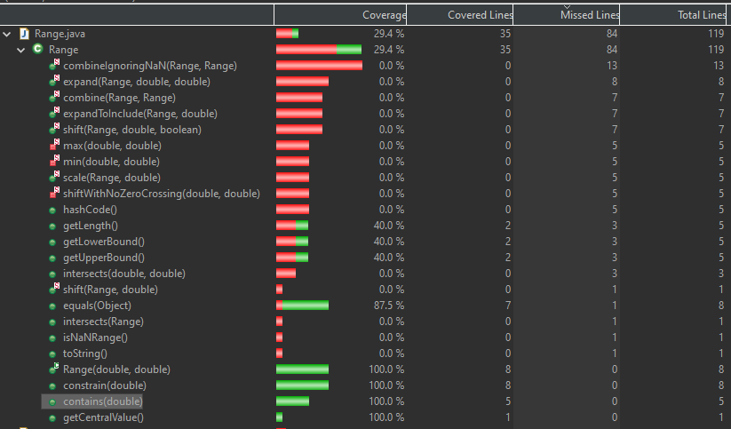

**SENG 637 - Dependability and Reliability of Software Systems**

**Lab. Report #3 – Code Coverage, Adequacy Criteria and Test Case Correlation**

| Group \#:6     |     |
| -------------- | --- |
| Student Names: |     |
| Sean Temple    |     |
| John Chernoff               |     |
| Nicholas Langley               |     |
| Raisa Mehjabin Azni            |   
| Eric Yoon            |   

(Note that some labs require individual reports while others require one report
for each group. Please see each lab document for details.)

# 1 Introduction

This assignment is similar to assignment 2 but with changed expectations and access to the source code allowing white box testing. After copying the tests from assignment 2 to the new codebase we tested for code coverage metrics before and after attempting to increase our code coverage. For one method from DataUtilities and one from Range we manually analyzed each generating data flow graphs and def-use information to determine what tests would be required for full coverage. Using mainly EclEmma we gathered reports on testing coverage for all tested methods in each class.

# 2 Manual data-flow coverage calculations for X and Y methods

Using EclEmma. Complexity here refers to cyclomatic complexity paths covered.

## Range

Constructor:
- 8/8 lines - 100% statement coverage
- 2/2 branches - 100% branch coverage
- 2/2 complexity - 100% complexity coverage

**Note both upper/lower/length methods use bound checks that lower is not > upper. We tried to create conditions to run that code and see no way to update or change lower/upper without memory editing. None of the other methods edit upper or lower; they just instantiate a new Range so with the constructor stopping any lower > upper its impossible to create such conditions.**

getLowerBound:
- 2/5 Lines- 40% statement coverage
- 1/2  branches - 50% branch coverage
- 1/2 complexity - 50% complexity coverage
	
getUpperBound:
- 2/5 Lines- 40% statement coverage
- 1/2 branches - 50% branch coverage
- 1/2 complexity - 50% complexity coverage

getLength:
- 2/5 Lines- 40% statement coverage
- 1/2  branches - 50% branch coverage
- 1/2 complexity - 50% complexity coverage

getCentralValue:
- 1/1 line- 100% statement coverage
- No branches to cover - 100% branch coverage
- 1/1 complexity - 100% complexity coverage

Contains:
- 5/5 Lines- 100% statement coverage
- 6/8 branches, - 75% branch coverage
- 3/5 complexity - 60% complexity coverage

Constrain:
- 8/8 Lines- 100% statement coverage
- 5/6 branches - 83.33% branch coverage 
- **another weird case will have to look into.**
- 3/4 complexity - 75% complexity coverage
	
Equals:
- 7/8 Lines- 87.5% statement coverage
- 5/6  branches - 83.33% branch coverage
- 3/4 complexity - 75% complexity coverage

Range Totals for intentionally covered methods:
- 30/40 Instructions = 75% Instruction Coverage
- 21/28 branch paths = 75% branch coverage
- 12/17 complexity = 70.59% complexity coverage


Figure1: Original Range statement(line) coverage


Figure2: Original Range branch Coverage


Figure 3: Original Range Complexity Coverage

Junit in combination with EclEmma provided all the information we needed.

## DataUtilities
**calculateColumnTotal**
  - 9/12 Lines = 75% statement Coverage 
  - 5/8 Branches = 62.5% branch coverage 
  - 3/5 Complexity = 60% complexity coverage
    
**calculateRowTotal**
- 9/12 Lines = 75% Instruction Coverage
- 5/8 Branches = 62.5% branch coverage
- 3/5 Complexity = 60% complexity coverage

**getCumulativePercentages**
- 15/18 Lines = 83.3% Instruction Coverage
- 7/12 Branches fully covered = 58.3% branch coverage
- 3/7 Complexity= 42.9% complexity coverage

**createNumberArray**
- 5/5 Lines = 100% Instruction Coverage
- 2/2 fully covered = 100% branch coverage
- 2/2 = 100% complexity coverage

**createNumberArray2D**
- 6/6 Lines= 100% Instruction Coverage
- 2/2 Branches fully covered = 100% branch coverage
- 2/2 Complexity = 100% complexity coverage

**DataUtilities Totals for Intentionally Covered Methods**
- 44/53 Instructions = 83.02% Instruction Coverage
- 21/32 Branch paths = 65.63% branch coverage
- 13/21 Complexity = 61.90% complexity coverage


Figure 4: Original Data Utilities Statement (Line) Coverage


Figure 5: Original Data Utilities Branch Coverage


Figure 6: Original Data Utilities Complexity Coverage

DataUtilities.calculateColumnTotal:

```java
public static double calculateColumnTotal(Values2D data, int column,
            int[] validRows) {
    ParamChecks.nullNotPermitted(data, "data");
    double total = 0.0;
    if (total > 0){
        total = 100;
    }
    int rowCount = data.getRowCount();
    for (int v = 0; v < validRows.length; v++) {
        int row = validRows[v];
        if (row < rowCount) {
            Number n = data.getValue(row, column);
            if (n != null) {
                total += n.doubleValue();
            }
        }
    }
    return total;
}
```

## Data Flow Chart:


## Def-use sets per statement:
1. ParamChecks.nullNotPermitted(data, "data");
   
Def: None (method call, no variables defined)  

Use: data
2. double total = 0.0;  

Def: total
  
Use: None
3. if (total > 0){ total = 100; }  

Def: total (inside the block)
  
Use: total (condition)
4. int rowCount = data.getRowCount();  

Def: rowCount

Use: data
5. for (int v = 0; v < validRows.length; v++) { ... }  

Def: v (initialization)

Use: validRows (condition), v (condition, increment)
Inside the loop:
6. int row = validRows[v];  

Def: row
 
Use: validRows, v
7. if (row < rowCount) { ... }  

Def: None
 
Use: row, rowCount
8. Number n = data.getValue(row, column);  

Def: n

Use: data, row, column
9. if (n != null) { total += n.doubleValue(); }  

Def: total

Use: n, total

## List All DU-Pairs Per Variable
- data: Used in ParamChecks, getRowCount(), getValue()
- total: Defined initially and possibly modified in the loop. Used in if condition and for accumulation.
- rowCount: Defined before the loop, used within the loop condition.
- v: Defined and used in the loop.
- validRows: Used in loop condition and to get row.
- row: Defined in the loop, used to get values.
- n: Defined in the loop, used in the null check.
## Coverage per Test Case
Each test case covers:
- The definition and use of data through mock interactions.
- The initialization and conditional modification of total.
- The definition and use of rowCount through data.getRowCount().
- The loop execution, affecting v, validRows, row, and the internal logic based on n.
Specific Coverages:
- With Positive Values: Covers the definition and use of all variables due to loop execution and conditions being met for positive value accumulation.
- With Null Input: Directly covers the null check on data.
- With Negative Values, Mixed Values, Zero Values, Large Dataset, No Rows: Each of these tests covers various aspects of the loop and conditionals, specifically the handling of different value types and quantities.

## Range.contains:
```java
    1 public boolean contains(double value) {
    2       if (value < this.lower) {
    3           return false;
    4       }
    5       if (value  > this.upper) {
    6           return false;
    7       }
    8       return (value >= this.lower && value <= this.upper);
    9 }
```

### Data Flow Graph:


### def-use sets per statement/line:

line: statement

1: public boolean contains(double value) {

    Def: value
    Use: None

2: if (value < this.lower) {

    Def: None
    Use: value
3: return false;

    Def: None
    Use: value
5:if (value  > this.upper) {

    Def: None
    Use: value, this.upper
6: return false;

    Def: None
    Use: value
8: return (value >= this.lower && value <= this.upper);

    Def: None
    Use: value, this.lower

list all DU-pairs per variable:

| Variable | Def in node | DCU | DPU |
|----------|-------------|-----|-----|
| value    |1| {1} |{(2,3),(2,4),(3,5),(3,6)}|

CU = 1, PU = 4

Test Cases and Covered DU-Pairs:

TC1:value<lower

TC2:value>upper

TC3:lower<value<upper

Other infeasible as it is impossible to have Range with lower > upper. Making line 8 the same as: return true; 
Good defensive programming to write line 8 the way it is though.
As such it's impossible to improve coverage.

# 3 A detailed description of the testing strategy for the new unit test

For the two classes we are testing, and each of the methods within, the general strategy is to run a coverage test and review it line by line. The coverage tests will be reviewed by all group members and the tests will be developed to improve coverage by all group members in coordination. Once the initial coverage test is run, each of the coverage areas which are instruction, branch and complexity will be reviewed for each method of each class. 

Where the coverage is initially incomplete or missed, the test code is manually inspected to see where the deficiency can be addressed. After implementing the change the coverage test is re-run to see if the deficiency is solved or not. This iterative process is conducted for each type of coverage until the minimum values of 90% for statements, 70% for branches, and 60% for conditions. 

# 4 A high level description of five selected test cases you have designed using coverage information, and how they have increased code coverage

For Range we had no new test cases designed as the testing from the last assignment covered all code that is possible to reach. The only parts not covered are inaccessible code that although should never be run is good defensive programming. The details for each method will be covered in later sections.

For DataUtilities a few updates were made:
getCumalitivePercentages had to be updated to include test cases for infinite, NaN, and null values. By adding in these test cases the instruction (statement) coverage was increased as some instructions were missed before.
createNumberArray and createNumberArray2D were updated with new test cases for infinity and NaN values to catch missing branches.
calculateColumnTotal and calculateRowTotal were updated with new test cases for infinity values to catch missing branches and instructions.

# 5 A detailed report of the coverage achieved of each class and method (a screen shot from the code cover results in green and red color would suffice)

Range
Added actual tests for contains. This results in no change to coverage amount as all actually reachable branch results were already covered. The coverage is actually intended now though
5/5 instructions -> 5/5 instructions (no change) - 100% statement
6/8 branches -> 6/8 branches (no change) - 75% branch coverage
3/5 complexity - 60% complex (no change) - 60% complexity

Range Totals remain at:
35/45 Instructions = 77.77% Instruction Coverage
27/36 branch paths = 75% branch coverage
15/22 complexity = 68.18% complexity coverage


Range Line coverage


Range Branch Coverage


Range complexity coverage

DataUtilities
Added two tests for getCumulativePercentages:
One including infinity/NaN values
One including null values

Other covered methods only had statements/branches that could not actually be reached so coverage could not be increased.

getCumulativePercentages:
15/18 -> 15/18 Lines (No change) - 83.3% Instruction Coverage
7/12 -> 9/12 branches - 75% branch coverage (+16.67%)
3/7 -> 5/7 complexity - 71.43% complexity coverage (+28.57%)


DataUtilities Totals for intentionally covered methods:
44/53 Instructions = 83.02% Instruction Coverage (No change)
23/32 branch paths = 71.88% branch coverage (+6.25%)
15/21 complexity = 71.43% complexity coverage (+9.53%)


Data Utilities statement coverage


Data Utilities branch coverage


Data Utilities complexity coverage

### Instruction Coverage

As shown above the equals method now has 100% coverage now that the test for when it is passed a non range object.

Details of the tested methods with less than 100% coverage:

92.9% coverage of contains method:

    public boolean contains (double value) {
        if (value < this.lower) {
            return false;
        }
        if (value  > this.upper) {
            return false;
        }
        return (value >= this.lower && value <= this.upper);
    }

The last 7.1% is from the last return statement only ever being evaluated to true as false can only occur if the lower bound is greater then the upper. lower will never be higher then upper as there are no setter methods and the constructor prevents a Range object from being created with lower higher then upper.

52.2% coverange of getLength

45% of getUpperBound and getLowerBound

All three of these methods have the same inaccessable code for the same reason as the contains method:

    if (lower > upper) {
        String msg = "Range(double, double): require lower (" + lower + ") <= upper (" + upper + ").";
            throw new IllegalArgumentException(msg);
    }

In summary the only reason the tests don't have 100% coverage is because the constructor prevents lower > upper and there is no way to access the private members to create such conditions without editing values in memory or some other kind of memory corruption.

### Branch Coverage


Same as instruction coverage the get methods for upper lower and length have the same issue where the code inside if (lower > upper) will never be ran.

The contains method has simlar issue to before where this method has branchs that will never run due to how the method is written.
original:

    public boolean contains(double value) {
        if (value < this.lower) {
            return false;
        }
        if (value  > this.upper) {
            return false;
        }
        return (value >= this.lower && value <= this.upper);
    }

Written so it works, has less code, less branches, and all code can be ran:

    public boolean contains(double value) {
        return (value >= this.lower && value <= this.upper);
    }

constrain although every line is ran has a else if statment that will never run as the if(!contains(value)) statment will prevent any value within the range from being evaluated at the else if (value < this.lower) making it always evaluate to true.

    public double constrain(double value) {
        double result = value;
        if (!contains(value)) {
            if (value > this.upper) {
                result = this.upper;
            }
            else if (value < this.lower) {
                result = this.lower;
            }
        }
        return result;
    }

Cleaner code that will allow all branches and intructions to be covered:

    public double constrain(double value) {
        double result = value;
        if (!contains(value)) {
            if (value > this.upper) {
                result = this.upper;
            }
            else {
                result = this.lower;
            }
        }
        return result;
    }

### Cyclomatic Complexity Coverage


For all the same reasons as before the get methods for upper, lower and length only have 50% coverage with no way to improve without just removing the bound checking in the source code.

equals method now has 100% coverage due to the test using non Range object. 

Constrain and contains have less than 100% coverage for the same reasons as before. Without altering the source code as shown in the branch coverage section it is impossible to increase the coverage.

# 6 Pros and Cons of coverage tools used and Metrics you report

This report employs EclEmma for reporting coverage metrics, benefiting from its support for statement and branch coverage, albeit lacking support for condition coverage. Despite exploring alternative tools, achieving condition coverage proved challenging. For example, although CodeCover offers condition coverage, it seems to have been discontinued from support, resulting in errors when attempting to use it with the current version of Eclipse. Upon researching the issue, it was found that only Eclipse Kepler is compatible with CodeCover. Attempts to install Eclipse Kepler for testing CodeCover encountered difficulties running JFreeChart code in that version. While JaCoCo presents a similar feature set to EclEmma, with no notable differences, the latter remains preferred. Clover, another tool that was successfully installed, unfortunately, did not recognize any of the JUnit test cases, consistently reporting zero coverage. This issue suggests that either some refactoring of the test suite setup is necessary or a more advanced configuration of the Eclipse workspace is required to operationalize Clover effectively, necessitating users to compile it themselves for IDE integration, a process hindered by inadequate instructions. As a result, EclEmma served as the sole tool for all test coverage assessments, replacing condition coverage with complexity coverage together with branch coverage and instruction coverage.

## EclEmma
EclEmma is a tool that seamlessly integrates with Eclipse and JUnit, providing immediate feedback on statement and branch coverage, which are easily highlighted. It features instruction coverage, which lists the amount of bytecode instructions covered. However, this metric can be somewhat misleading as the numbers do not directly correlate with lines of code. This discrepancy means that missing certain instructions could significantly impact the coverage percentage. This detail is particularly relevant for lines containing complex instructions, as ensuring these instructions are tested may disproportionately influence the coverage metric.

Line coverage, on the other hand, is straightforward, indicating the specific lines of code that tests cover. It offers a clear visual on which portions of the code are tested but falls short in detailing complex interactions, such as branch or condition coverage.

Branch coverage focuses on the decision points within the code, allowing developers to identify which conditions have not been fully explored. However, it lacks specificity in indicating which particular branch or condition was missed, necessitating manual investigation to address these gaps.

Complexity coverage delves into the paths taken through an entire method, shedding light on more intricate behaviors and the effectiveness of test coverage on method utilization. Like branch coverage, it does not specify which paths were or were not covered, requiring further manual analysis to enhance coverage. Unfortunately, there is no easily visible overlay over the code for this metric.

Method coverage is simpler, essentially indicating whether a method has been tested. This is particularly useful for larger codebases, helping identify untested methods. However, in the context of this lab, its utility is limited due to the ease of manually tracking method coverage.

### Features and Limitations

- **Works out of the box with Eclipse + JUnit**
- **Highlights statement/branch coverage easily**

- **Instruction coverage**: lists amount of bytecode instructions covered, somewhat misleading as the numbers are not 1-1 with lines of code, so depending on which instructions are missed, may have a larger impact on coverage percentage.
- **Line Coverage**: individual lines of code covered, easy to understand and can tell at a glance what portions of code tests cover. Doesn’t fully explain the more complex interactions for metrics like branch or condition coverage.
- **Branch coverage**: branch decisions covered, easily see which are not fully explored, to see which conditions tests need to be based around. Does not seem to tell you which specific branch condition(s) were missed just that some were missed. So manual investigation will need to be done to find this out.
- **Complexity coverage**: paths through the entire method taken, covers more complex behaviors. Can give you an idea of how well the method is utilized by the tests. Does not tell you which possible paths are covered/missed so manual investigation will have to be done to figure out how to raise this coverage. No easily visible overlay over the code.
- **Methods coverage**: mostly just tells you if a method is covered or not. Useful on a larger codebase scale, to see if methods are missed by testing. On the scale of this lab, however, it is pretty useless as it's easy to keep track of this manually.

## CodeCover
The instructions on the code cover site for installing the Eclipse Plugin do not seem to work so this could not be tested.

## Clover
Able to install, but could not get it to recognize any of the JUnit test cases. Always returned zero coverage. Appears to need some refactoring of test suite setup or more advanced Eclipse workspace setup to get working.

# 7 A comparison on the advantages and disadvantages of requirements-based test generation and coverage-based test generation.

Text…

# 8 A discussion on how the team work/effort was divided and managed

Our team divided work based on individual strengths. We assigned the manual data flow coverage calculations to members with strong analytical skills (John, Sean, Nicholas), while those interested in report organization and writing took on the simpler report sections (Eric, Raisa). We held weekly meetings to track progress, share insights, and collaboratively solve and provide feedback on the new designed unit tests. Task division was dynamic; members could trade tasks based on personal workload or health. Whenever a group member was sick, the work would be picked up by another group member, which improved teamwork and organization of the team. Furthermore, we used a shared repository for code and documentation, ensuring that all team members could review and contribute to each other's work, fostering a collaborative learning environment.

# 9 Any difficulties encountered, challenges overcome, and lessons learned from performing the lab

In addition to the initial challenges, we faced difficulties in manually calculating data flow coverage due to the complexity of understanding the flow of data through the code. This exercise, while challenging, significantly improved our comprehension of how data moves within programs and how this affects testing strategies. We learned the importance of thorough code understanding before test case development, enhancing our ability to write more effective tests.

Regarding lessons learned, one thing that helped significantly was the practice of reflection and feedback—both on the technical aspects of testing and our teamwork. After developing new design tests, we took the time to reflect on what worked, what didn't, and how we could improve which gave us new insights to different ways of coding.

Another lesson was that coverage is a valuable tool for pinpointing what's lacking in test cases. However, it only evaluates if the tests address all aspects of the code, overlooking the requirements. The requirements are important as well in regards to testing, so both work in unison to provide a comprehensive evaluation of the software's functionality and reliability.


# 10 Comments/feedback on the lab itself

The assignment was well-structured, providing a clear pathway from understanding the basics of testing to applying complex coverage criteria. It was a great opportunity to benchmark how well our unit testing using black-box test-case design techniques in the previous assignment performed, and also how much we could improve it by.

However, a more detailed guide on selecting and using code coverage tools would be beneficial, as some team members found the initial setup challenging. Overall, the assignment was an eye-opening learning experience, offering practical skills in testing and insights into test adequacy and code coverage.

## 5 Evaluation Criteria
5.1 JUnit Test Suite (50%)
The test suite will be required to be submitted along with the lab report. Students will be graded on their unit tests. The grading criteria are as follows.

Marking Scheme	
Code coverage: lesser coverage than coverage target specified in lab instructions above, would decrement your mark proportionally, unless you explain it by a valid the reason (e.g., infeasible path)	20%
Clarity (are they easy to follow, through commenting or style, etc.?)	15%
Correctness (do the tests actually test what they are intended to test?)	15%

5.2 Lab Report (50%)
Students will be required to submit a report on their work in the assignment as a group. To be consistent, please use the template markdown file (seng637-a3-team_number.md) provided online under the Assignment 3 folder. If desired, feel free to rename the sections, as long as the headings are still descriptive and accurate. In the report should be included.

Marking Scheme	
Manual data-flow coverage calculations the two mentioned methods	15%
A detailed description of the testing strategy for the new unit tests	5%
A high level description of five selected test cases you have designed using coverage information, and how they have increased code coverage	10%
A detailed report of the coverage achieved of each class and method (a screen shot from the code cover results in green and red color would suffice)	5%
Pros and cons of the coverage tools tried by your group in this assignment, in terms of reported measures, integration with the IDE and other plug-ins, user friendliness, crashes, etc.	5%
A comparison on the advantages and disadvantages of requirements-based test generation and coverage-based test generation.	5%
A discussion on how the team work/effort was divided and managed	2%
Any difficulties encountered, challenges overcome, and lessons learned from performing the assignment	2%
Comments/feedback on the assignment itself	1%
A portion of the grade for the lab report will be allocated to organization and clarity.
